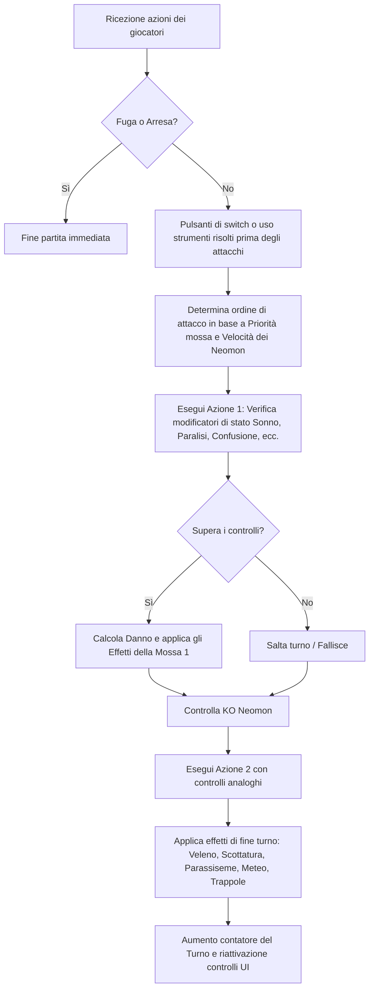

# Progetto_Pokemon_D-esame
progetto di maturità di Dere Omar Ahmed e Grasso Alessio.

Neomon è una **Web-App multiplayer 2D** ispirata a Pokémon, sviluppata in **JavaScript** con il motore grafico **Phaser.js** per il client e **Node.js** (con **Socket.io**) per il server in tempo reale, appoggiandosi a **Supabase (PostgreSQL)** per la persistenza dei dati.

---

## 1. Struttura del Progetto

Il codice sorgente è organizzato all'interno della cartella principale `Pokemon`, divisa in tre sezioni principali:

* **Backend:** Gestisce le connessioni di rete in tempo reale e il flusso del turno PvP.
* **Shared:** Condivide la logica core dei calcoli della battaglia e i database statici tra client e server.
* **Frontend (`src` e `public`):** Gestisce il ciclo di vita del gioco, l'interfaccia utente (UI), i controlli, le mappe e la grafica.

### Albero delle Directory e File Chiave

* **Pokemon/backend/**
* `server.js`: Server Node.js (Express + Socket.io) per la sincronizzazione multiplayer.

* **Pokemon/shared/**
* `core/gestione_partita.js`: State machine del combattimento a turni (condivisa tra locale e server).
* `core/funzioni_effetti.js`: Implementazione dettagliata degli effetti delle mosse.
* `core/gestione_flags.js`: Lettura ed elaborazione delle proprietà speciali delle mosse.
* `data/DB_pokemon.json`: Statistiche base e sprite di ciascun Pokémon.
* `data/DB_mosse.json`: Potenza, precisione, effetti e flag di ciascuna mossa.

* **Pokemon/src/**
* `main.js`: Entry-point del gioco e configurazione di Phaser.
* **scenes/**
* `BootScene.js`: Pre-caricamento degli asset (mappe, spritesheet avatar, json).
* `LoginScene.js`: Gestione dell'autenticazione tramite Supabase (Email, Google, password recovery).
* `StarterScene.js`: Assegnamento dei primi 3 Neomon casuali per i nuovi profili.
* `WorldScene.js`: La lobby principale, con PC, salvataggio profilo, cambio avatar e portali.
* `PVEScene.js`: Mappa PVE roguelike (incontri selvatici, allenatori bot, livelli a stanze).
* `PvPScene.js`: Arena PvP online con sincronizzazione degli avatar degli altri giocatori.
* `CPKScene.js`: Centro Pokémon con l'infermiera e il PC per la gestione del box.
* `BattleScene.js`: UI di combattimento a turni per tutte le modalità.

* `services/supabaseAuth.js`: Wrapper di inizializzazione della connessione con Supabase Client.
* `utils/helpers.js`: Funzioni ausiliarie (rilevamento touch, banner notifiche).
* `utils/tasti_input.js`: Mappatura dei controlli tastiera (WASD, frecce, Enter, Esc, Shift).

---

## 2. Flusso e Funzionamento dei Componenti

### 2.1 Autenticazione e Persistenza dei Dati (Supabase & Postgres)

* Quando il gioco si avvia, la scena iniziale `LoginScene.js` controlla la sessione JWT. Se assente, offre un'interfaccia HTML integrata (tramite Phaser DOM Container) per il login, registrazione, autenticazione con Google o reset password.
* Una volta autenticato, il client contatta Supabase per recuperare:
1. Il profilo del giocatore (`profilo`): contiene nickname, contatori di vittorie, partite giocate, volume delle tracce audio, avatar_sprite selezionato e `id_mappa` (per riprendere i salvataggi PVE).
2. I Pokémon associati (`pokemon`): caricati ordinandoli per `posizione_slot`. Se la lista è vuota (nuovo allenatore), il sistema estrae 3 starter casuali dal database statico, li inserisce in tabella via Supabase e mostra la `StarterScene.js`.

### 2.2 Il Mondo di Gioco e le Mappe (Phaser RPG 2D)

Il gioco ha una visuale classica da RPG 2D a griglia. Le scene del mondo (`WorldScene.js`, `PVEScene.js`, `CPKScene.js` e `PvPScene.js`) seguono una logica simile:

1. **Mappa Tilemap:** Caricata da file `.tmj` esportati da Tiled (es. `mappa.tmj`). Vengono renderizzati i layer di background, gli ostacoli (`Ostacoli`, con collisione abilitata) e le zone d'erba.
2. **Movimento a Griglia:** Il movimento avviene pixel per pixel a intervalli di 16px (dimensione di una tile). Se il giocatore preme una direzione, Phaser verifica se la tile di destinazione contiene ostacoli o un NPC. In caso negativo, un `Tween` sposta gradualmente l'avatar in 250ms con l'animazione di camminata.
3. **Incontri ed Aree Interattive:**
* Al termine del movimento nell'erba alta (`grassLayer`), c'è una probabilità (5% nella Lobby, 10% in PVE) di avviare una battaglia casuale.
* La sovrapposizione con i punti caldi dell'oggetto "Interazioni" avvia il cambio di scena (es. camminare sopra la porta del Centro Pokémon cambia scena in `CPKScene.js`).
* Premendo `Enter` vicino a un computer si avvia la gestione della squadra (`apriPC`).

### 2.3 Sincronizzazione Multiplayer (Socket.io)

Nel PvP (`PvPScene.js`):

* All'avvio, il client stabilisce una connessione WebSocket con il server centrale tramite `socket = io(serverUrl)`.
* Il client invia `joinGame` con il proprio nickname. Il server lo aggiunge all'oggetto globale `players` e risponde inviando l'elenco dei giocatori già connessi.
* Ad ogni movimento del giocatore, il client emette `playerMovement` indicando coordinate, animazione corrente e avatar. Il server riceve il pacchetto e lo distribuisce in broadcast a tutti gli altri client tramite `playerMoved`. Ciascun client aggiorna la posizione degli altri giocatori tramite interpolazione fluida (`Tween`).
* Se un giocatore preme `Enter` vicino ad un altro avatar, il client emette `challengePlayer`. Se l'avversario accetta, il server crea una stanza di gioco (`battleRooms[roomId]`), bloccando lo stato `inBattle = true` per entrambi e inviando l'evento `startPvP` per reindirizzarli alla scena di battaglia.

### 2.4 Il PC e la Gestione dei Neomon

Dalla lobby o dal Centro Pokémon, il giocatore può interagire con i computer della mappa per modificare il proprio party (composto da un massimo di 3 Neomon attivi in battaglia). L'interfaccia del PC:

* Interroga Supabase per caricare tutti i Pokémon posseduti dal profilo.
* Suddivide i Neomon tra quelli "In Squadra" (attributo `in_squadra = true` ordinati da 1 a 3) e quelli nei "Box".
* Tramite un overlay DOM in sovrimpressione, il giocatore può spostare Neomon tra i Box e la Squadra o visualizzarne il "Summary" (con statistiche base, modificatori, e descrizione dettagliata delle 4 mosse equipaggiate).
* All'uscita del PC, le modifiche di posizionamento o squadra vengono salvate nel database Postgres di Supabase, mantenendo l'integrità del salvataggio.

---

## 3. Il Motore di Combattimento (Combat Engine)

La logica delle battaglie è racchiusa nello script condiviso `gestione_partita.js`. Questo modulo funziona sia sul client per i combattimenti locali (contro Pokémon selvatici o NPC bot) sia sul server per le partite PvP online, garantendo che i calcoli non siano manipolabili.

### 3.1 Il Ciclo del Turno

Il flusso di un turno di combattimento si articola nelle seguenti fasi all'interno del metodo `processaTurno(azioneP1, azioneP2)`:

### 3.2 Calcolo del Danno

La formula del danno implementata in `calcolaDanno(attaccante, difensore, mossa, targetPlayer)` rispecchia la formula ufficiale dei giochi Pokémon di terza/quarta generazione:

$$Danno = \left( \frac{\left( \frac{2 \times Livello}{5} + 2 \right) \times PotenzaReale \times \frac{Attacco}{Difesa}}{50} + 2 \right) \times STAB \times Efficacia \times Casuale \times Schermi \times Meteo$$

* **Attacco e Difesa:** Vengono scelti in base alla categoria della mossa (`Fisico` usa Attacco/Difesa, `Speciale` usa Attacco Speciale/Difesa Speciale). Alcune mosse sovrascrivono questa logica (es. mosse che colpiscono la difesa fisica pur essendo speciali).
* **Modificatori di Statistica (Stages):** I modificatori variano da -6 a +6. Il valore base viene moltiplicato in base al grado:
* Gradi positivi: $\frac{2 + Grado}{2}$
* Gradi negativi: $\frac{2}{2 - Grado}$

* **Colpo Critico (Brutto Colpo):** Viene calcolato in base al tasso critico. Se si verifica (danno $\times$ 1.5):
* I cali di attacco dell'attaccante vengono ignorati.
* I potenziamenti di difesa del difensore vengono ignorati.

* **STAB (Same Type Attack Bonus):** Se il tipo della mossa coincide con uno dei tipi dell'attaccante, il danno aumenta del 50% ($\times$ 1.5).
* **Efficacia dei Tipi:** Calcolata incrociando il tipo della mossa con la matrice delle resistenze e debolezze `EfficaciaTipi` per ciascun tipo del difensore (può risultare in $\times$ 0.25, $\times$ 0.5, $\times$ 1, $\times$ 2, $\times$ 4 o $\times$ 0 per le immunità).
* **Casuale:** Un fattore di variazione randomica compreso tra 0.85 e 1.00.
* **Meteo:** Se c'è `Sole`, le mosse di tipo Fuoco fanno il 50% di danni in più e quelle Acqua il 50% in meno (viceversa sotto la `Pioggia`).
* **Schermi:** `Riflesso` dimezza i danni fisici, `SchermoLuce` dimezza i danni speciali.

### 3.3 Gestione degli Effetti e Modificatori (funzioni_effetti.js)

Il file delle funzioni ausiliarie gestisce tutti gli effetti secondari dichiarati nel database delle mosse all'interno dell'array `CodiceFunzione`:

* **Effetti di Stato:** `ApplicaStato` gestisce gli stati principali (`Sonno`, `Scottatura`, `Paralisi`, `Avvelenamento`, `Iperavvelenamento`, `Congelamento`).
* **Trappole sul Campo (Hazards):** `PiazzaTrappola` consente di piazzare `Levitoroccia` (danno all'ingresso basato sulla debolezza al tipo Roccia), `Punte` (danno fisso a terra) e `Fielepunte` (avvelenamento all'ingresso). Esse vengono risolte all'ingresso in campo di un Neomon in `applicaTrappoleAlPokemon`.
* **Stati Volatili:** `ApplicaStatoUnico` e `Intrappola` permettono di gestire effetti specifici temporanei:
* *Parassiseme (Leech Seed):* Ruba $\frac{1}{8}$ degli HP massimi del bersaglio a fine turno e li cede all'attaccante.
* *Ultimocanto (Perish Song):* Avvia un timer di 3 turni per entrambi i Pokémon in campo; al termine del conto alla rovescia, il Neomon va KO.
* *Confusione:* Il Neomon ha il 33% di possibilità di colpirsi da solo a ogni turno con un attacco fisico di potenza 40.
* *Inibitore / Provocazione:* Bloccano rispettivamente l'uso dell'ultima mossa usata o delle mosse di categoria "Stato".

### 3.4 L'Intelligenza Artificiale dei Bot (`scegliMossaBotIntelligente`)

Nelle battaglie PvE e nel tutorial, l'avversario è gestito da un bot. Anziché scegliere mosse a caso, l'IA calcola un punteggio di utilità per ciascuna mossa disponibile:

1. **Calcolo Efficacia:** Le mosse d'attacco partono da un punteggio pari alla loro potenza base, moltiplicato per l'efficacia del tipo sul difensore (escludendo mosse a efficacia 0).
2. **Priorità di cura:** Se gli HP del Bot sono inferiori al 40%, le mosse di tipo `Cura` ricevono un bonus di utilità elevato (+300). Se superiori all'80%, l'IA le penalizza (-500).
3. **Stati Alterati:** Se il giocatore ha già uno stato alterato, il bot evita di lanciare mosse di alterazione di stato (penalità di -500). Altrimenti, attribuisce priorità a mosse come tossina o paralisi se il Neomon del giocatore ha ancora molta vita.
4. **Buff & Debuff:** Se una statistica è già stata modificata al massimo (+6 o -6), l'IA evita ulteriori buff/debuff.
5. **Variazione Casuale:** Al punteggio totale viene addizionato un piccolo valore casuale (da 0 a 15) per evitare che il comportamento del bot sia perfettamente prevedibile a ogni partita.

---

## 4. UI e Integrazione nel Client

Phaser.js gestisce il canvas di rendering del gioco, ma per semplificare lo sviluppo di interfacce complesse (come i moduli di login, il PC dei box o la visualizzazione delle statistiche), il progetto utilizza i **DOM Element di Phaser** (`Phaser.GameObjects.DOMElement`).

* Le interfacce HTML e le classi CSS sono caricate dinamicamente tramite template string e inserite nel contenitore `#game-container` in modo da rimanere scalate e centrate con la finestra di gioco.
* Durante la battaglia (`BattleScene.js`), l'interfaccia si adatta dinamicamente:
* Premendo **Shift**, si attiva l'overlay CSS `#stats-overlay` che mostra graficamente i livelli dei modificatori di attacco, difesa, velocità ecc. di entrambi i Neomon.
* Il pannello dei comandi inferiore gestisce i bottoni della lotta, della borsa, del party o della fuga, aggiornando a destra il pannello delle informazioni sul tipo, categoria, potenza e PP della mossa selezionata con colori corrispondenti.
